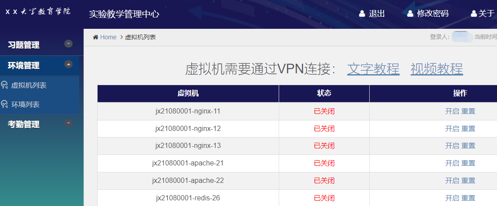
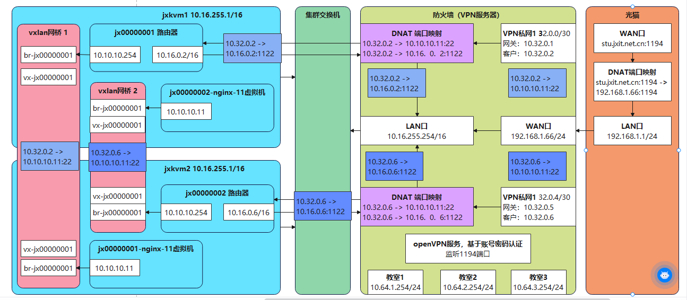

# 起点教学云

## 纯 脚本+Vxlan+KVM+Mysql+NFS，1000行代码实现的私有云，适合学习研究
1. 每个学生固定分配20台虚拟机和一个路由器，可以自由开启、关闭、重置。
2. 基于[B站教学视频](https://space.bilibili.com/621002172)模拟搭建实际生产环境，适合Linux运维培训学习
3. 体验地址：[http://oa.jxit.net.cn](http://oa.jxit.net.cn) 账号：jx21080001 密码：qdcloud
4. 进入后点击视频或文字教程，通过VPN连接虚拟机



## 软件架构
1. 系统最低为三台服务器，一台管理+存储，两个计算节点，其中管理至少两个网卡。
2. 每个学生在所有计算节点创建一个vxlan隧道网桥，相当于该学生的虚拟交换机（网段10.10.10.0/24）。
3. 每个学生都有一个路由器，LAN口接入该学生的vxlan网桥，WAN口桥接到计算集群物理交换机（网段10.16.0.0/16），并根据学号分配固定IP。
3. 每个学生都要通过VPN连接到管理节点，根据学生为VPN客户端分配固定IP（网段10.32.0.0/16）。
4. 管理节点通过iptables对每个学生的每个虚拟机进行22和80端口映射，学生在客户端即可连接虚拟机。
5. 如果有公网IP，只需在光猫上映射管理节点的1194端口，即可实现外网连接



## 安装操作系统
1.  安装管理节点，管理节点使用[Centos9-stream镜像](http://stu.jxit.net.cn:88/qdcloud/CentOS-Stream-9-latest-x86_64-boot.iso)最小化安装
2.  管理节点相当于所有计算节点的路由器，WAN口IP随意，能上网即可， **LAN口IP必须为10.16.255.254/16！** 
3.  计算节点安装[Centos7-2009镜像](http://stu.jxit.net.cn:88/qdcloud/CentOS-Stream-9-latest-x86_64-boot.iso)，IP地址建议为10.16.255.1/16、10.16.255.2/16、...，网关为10.16.255.254，并保证和管理节点的LAN口在同一交换机


## 部署起点云

### 最好先看一遍部署的[视频讲解](http://stu.jxit.net.cn:88/mp4/shizhan/qdcloud/qdcloud_deploy.mp4)

1.  下载项目代码：git clone https://gitee.com/laoyang103/qdcloud.git
2.  进入项目目录：cd qdcloud
3.  执行安装脚本：bash -x doc/qdcloud.sh（建议先阅读一下脚本，每一步都有注释）

### 创建学生虚拟磁盘
1.  对于每个学生都需要执行mkstu.sh [学生ID]进行创建虚拟磁盘
2.  部署完毕后本机数据库已经自带200个学生，数据库root密码123456，学生的ID在lab_user表，字段为user_id

## 日常维护命令
### 查看虚拟机分配
```
[root@jxvpn qdcloud]# qdctl list
======================= vm in 10.16.255.1 =============================
 6     jx00000003-dev-71            running
 9     jx00000003-mysql-proxy-31    running
 11    jx00000003-mysql-master-36   running
 12    jx00000003-mysql-slave-37    running
 13    jx00000003-mysql-slave-38    running
======================= vm in 10.16.255.5 =============================
 17    jx21080005-apache-22         running
 18    jx21080005-mysql-master-36   running
 25    jx23020008                   running
 45    jx23020010                   running
 47    jx23020001                   running
```

### 查看登录日志
```
[root@jxvpn qdcloud]# qdctl log
2023-06-20 16:09:27     jx23020004      吴海玉  10.64.1.177
2023-06-20 16:15:36     jx23010002      李艳东  10.64.1.182
2023-06-20 16:17:08     jx23020009      李思彤  10.64.1.112
2023-06-20 16:20:08     jx23020004      吴海玉  10.64.1.177
2023-06-20 16:21:03     jx23010004      葛玉达  10.64.1.183
```

## 有任何问题+V：553069938